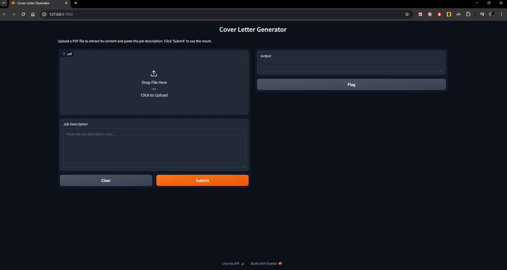

# Cover Letter Generator using LLM

## 📌 Project Overview
This project generates a tailored cover letter using a job description and a resume. It leverages **Groq LLM** to extract key job attributes, identify challenges, and craft a compelling cover letter.



## 🚀 Features
- 📄 Upload a **PDF resume**
- 🏢 Extract **role & company name** from a job description
- 🔍 Identify **key challenges** of the role
- ✍ Generate a **personalized cover letter**
- 📋 Copy the cover letter with a single click

## 🛠️ Tech Stack
- **Python** (Backend)
- **Gradio** (Frontend UI)
- **Groq API** (LLM)
- **PyMuPDF** (PDF Processing)

## 🏗️ Setup & Installation
### 1️⃣ Clone the Repository
```sh
git clone https://github.com/your-username/your-repo-name.git
cd your-repo-name
```
### 2️⃣ Create a Virtual Environment
```sh
python -m venv env
source env/bin/activate  # On Windows use `env\Scripts\activate`
```
### 3️⃣ Install Dependencies
```sh
pip install -r requirements.txt
```
### 4️⃣ Set Up API Key
Create a `.env` file and add:
```env
GROQ_API_KEY=your_api_key_here
```

### 5️⃣ Run the Application
```sh
python main.py
```

## 🎯 Usage
1. **Upload your resume (PDF format)**
2. **Paste the job description**
3. **Click "Generate"** to create a tailored cover letter
4. **Copy & use your cover letter** for applications!

## 📜 .gitignore
Ensure sensitive files are not tracked:
```
.env
env/
__pycache__/
*.pyc
```

## 📬 Contributions
Feel free to fork this project and submit pull requests. Any feedback or improvements are welcome!

## Acknowledgements

- Special thanks to **Jeff Su** for his **prompt engineering** techniques, which played a key role in the success of this cover letter generation model.
- https://www.youtube.com/watch?v=NUhDP30IRKk&ab_channel=JeffSu

## 📄 License
This project is licensed under the MIT License.

---

Made with ❤️ by Vedaant Joshi
